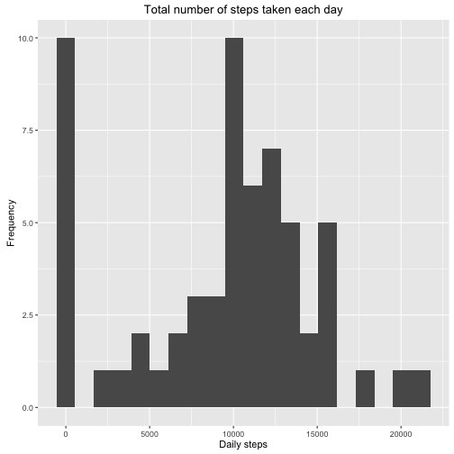
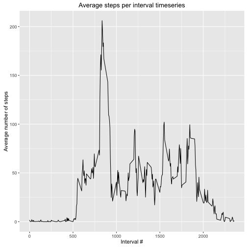
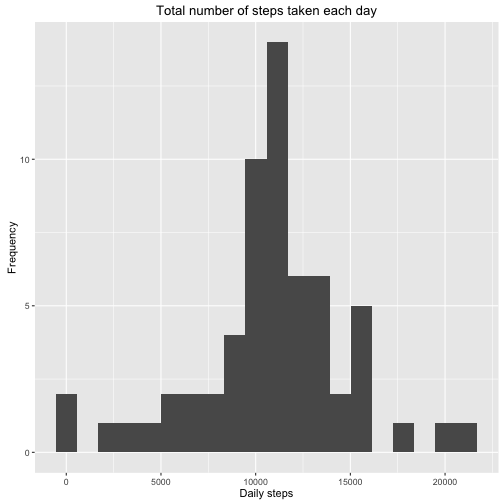
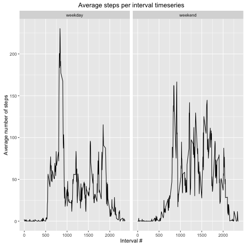

Code for reading needed libraries:


```r
library(dplyr)
library(ggplot2)
```

#### 1. Code for reading in the dataset and processing the data:


```r
loadFiles <- function(url, destFile) {
  if (!file.exists(destFile)) {
    download.file(url, destFile, method="curl")
    unzip(destFile)
  }
}

loadData <- function(dataFile, ...) {
  data <- read.csv(paste(".", dataFile, sep="/"), ...)
}

url = "https://d396qusza40orc.cloudfront.net/repdata%2Fdata%2Factivity.zip"
destFile = "repdata-data-activity.zip"
dataFile = "activity.csv"

loadFiles(url, destFile)
activity <- loadData(dataFile)
daily_totals <- activity %>%
                  group_by(date) %>%
                  summarise(stepcount = sum(steps, na.rm = TRUE))
daily_average <- activity %>%
                   group_by (interval) %>%
                   summarise(avg_steps = mean(steps, na.rm = TRUE))
```

#### 2. Code for plotting the daily stepcount histogram:


```r
ggplot(daily_totals, aes(stepcount)) + 
  labs(title ="Total number of steps taken each day",
       x = "Daily steps",
       y = "Frequency") +
  geom_histogram(bins=20)
```



#### 3. Mean and median number of steps taken each day are simplest to find with the summary function:


```r
summary(daily_totals)
```

```
##          date      stepcount    
##  2012-10-01: 1   Min.   :    0  
##  2012-10-02: 1   1st Qu.: 6778  
##  2012-10-03: 1   Median :10395  
##  2012-10-04: 1   Mean   : 9354  
##  2012-10-05: 1   3rd Qu.:12811  
##  2012-10-06: 1   Max.   :21194  
##  (Other)   :55
```

#### 4. Code for plotting the average number of steps taken timeseries:


```r
ggplot(daily_average, aes(interval, avg_steps)) + 
  labs(title ="Average steps per interval timeseries",
       x = "Interval #",
       y = "Average number of steps") +
  geom_line()
```



#### 5. Interval with the maximum number of steps on average is 8:35 to 8:40 AM:


```r
daily_average[which.max(daily_average$avg_steps), ]$interval
```

```
## [1] 835
```

#### 6. Code for replacing missing (NA) step counts
Replacing with the mean value for the respective interval; added a data frame comparison at the end to prove NA values have indeed disappeared:


```r
activity_nona <- merge(activity, daily_average, by = "interval") %>%  
                   arrange(date, interval)
na_steps <- which(is.na(activity_nona$steps) == TRUE)
for (i in na_steps)
  activity_nona[i, ]$steps <- as.integer(activity_nona[i, ]$avg_steps)

summary(activity$steps)
```

```
##    Min. 1st Qu.  Median    Mean 3rd Qu.    Max.    NA's 
##    0.00    0.00    0.00   37.38   12.00  806.00    2304
```

```r
summary(activity_nona$steps)
```

```
##    Min. 1st Qu.  Median    Mean 3rd Qu.    Max. 
##    0.00    0.00    0.00   37.33   27.00  806.00
```

#### 7. Code for another histogram with data frame having NA values replaced:


```r
daily_totals <- activity_nona %>%
                  group_by(date) %>%
                  summarise(stepcount = sum(steps))

ggplot(daily_totals, aes(stepcount)) + 
  labs(title ="Total number of steps taken each day",
       x = "Daily steps",
       y = "Frequency") +
  geom_histogram(bins=20)
```



#### 8. Code for plotting weekday vs. weekend activity patterns:


```r
activity_nona$kind_of_day <-
  factor(ifelse(weekdays(as.Date(activity$date)) %in%
           c("Saturday","Sunday"),
         "weekend",
         "weekday"))
daily_average <- activity_nona %>%
                   group_by (kind_of_day, interval) %>%
                   summarise(avg_steps = mean(steps))
ggplot(daily_average, aes(interval, avg_steps)) + 
  labs(title ="Average steps per interval timeseries",
       x = "Interval #",
       y = "Average number of steps") +
  facet_grid(. ~ kind_of_day) +
  geom_line()
```



#### 9. All of the R code needed
All of R code needed is included in this .Rmd file. This was tested by removing all data from the working directory (apart from this file), and successfully running the script with ```knitr```.
